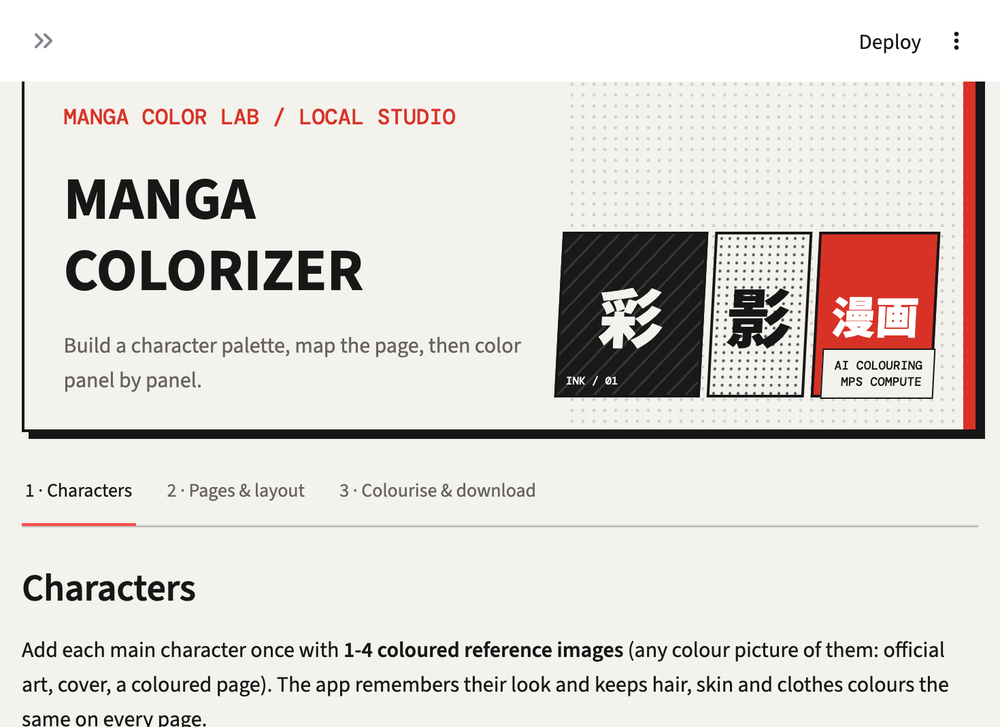

# Manga Colorizer

A browser-based tool for adding color to black-and-white manga pages. Build a character color guide, review detected panels, and color pages with either a fast local preview or an AI-assisted coloring pipeline.



## Features

- Add character reference pictures and optional descriptions.
- Detect and lock character colors for hair, skin, clothing, shoes, and other supported parts.
- Upload manga pages as PNG, JPG/JPEG, WEBP, BMP, or AVIF images.
- Upload a PDF, CBZ, or ZIP archive containing supported page images.
- Detect page panels and speech bubbles, then review character assignments before coloring.
- Choose a fast palette-based preview or AI coloring with line-art guidance and character references.
- Download colored pages individually or together as a ZIP archive.
- Select right-to-left manga reading order or left-to-right order.
- Run on Apple Silicon (MPS), NVIDIA CUDA, or CPU. CPU processing is supported but can be slow.

## How It Works

1. **Characters:** Add one to four colored reference pictures for each recurring character. Automatic color detection is optional; part colors can also be entered and locked manually.
2. **Pages & layout:** Upload one or more pages, then analyze them. Review detected panels and character assignments, and correct them where needed.
3. **Colorise & download:** Run the quick preview or AI coloring mode, then download the finished page or a ZIP.

The AI coloring pipeline uses Stable Diffusion 1.5, an anime line-art ControlNet, and IP-Adapter. Supporting models are used for character detection, reference matching, and clothing/part segmentation. Model files are fetched from Hugging Face on first use and cached locally; the downloads are several gigabytes in total. A stable internet connection is needed for the initial download.

## Requirements

- macOS, Linux, or Windows with Python 3.9 or newer; Python 3.11 is recommended.
- Internet access for installing packages and downloading AI models.
- Several gigabytes of free storage for AI model files.
- For AI coloring, enough system memory to run the selected models. NVIDIA GPUs and Apple Silicon are supported; CPU mode is slower.

Quick preview does not require AI model downloads.

## Run Locally

Clone the repository and enter its directory:

```bash
git clone https://github.com/afk-Parth/manga-colorizer.git
cd manga-colorizer
```

Create the environment and install dependencies:

```bash
bash setup.sh
```

Start the app:

```bash
bash run_ui.sh
```

Open the local URL printed by Streamlit, usually http://localhost:8501. The first AI run downloads the model files; subsequent runs reuse the local cache. To download models in advance, run:

```bash
bash download_models.sh
```

## Using Quick Preview

Choose **Quick preview** under **Colouring mode** in the sidebar. This mode uses local image processing and a character palette to make a fast flat-color preview. Use it to check page and panel detection before trying AI coloring.

## Settings

- **Quality:** Choose Fast, Balanced, or High. Higher settings use larger images and more inference steps, increasing processing time and memory use.
- **Reading direction:** Choose right-to-left for manga or left-to-right.
- **Advanced:** Adjust reference-image influence, line-art influence, color consistency correction, character detection, and memory use.
- **Low-memory mode:** Reduces memory pressure for AI coloring, at the cost of speed.

## Data and Privacy

When run locally, uploaded pages, character references, and results are processed on your computer. Character data is stored in `characters/`, and generated output is stored under `workspace/output/`. These folders are excluded from Git by `.gitignore`.

If deployed to a hosted server, uploads are sent to that server for processing. Do not upload pages or reference images unless you have the rights to use them and are comfortable with the deployment operator's storage and privacy arrangements. This project does not provide multi-user accounts or a managed privacy/storage policy by itself.

## GPU Server Deployment

The full AI workflow needs a CUDA-capable NVIDIA GPU. Streamlit Community Cloud does not provide GPU compute and is not configured for this full AI deployment. The included `Dockerfile` runs the Streamlit app on a GPU host such as RunPod or a CUDA-enabled Linux server. A Community Cloud preview would need a separate lightweight dependency configuration and would not include full AI coloring.

Every push to `main` that changes the app or its dependencies triggers [the GPU image workflow](.github/workflows/publish-gpu-image.yml), which builds a Linux image and publishes it to GitHub Container Registry as `ghcr.io/afk-parth/manga-colorizer:latest`. After the first workflow completes, set the published package visibility to **Public** in the GitHub package settings if the GPU provider cannot pull private images.

For a RunPod-style GPU pod:

1. Select an NVIDIA GPU with at least 12 GB VRAM recommended for AI coloring. More memory gives better headroom; actual speed depends on the GPU and settings.
2. Use the container image `ghcr.io/afk-parth/manga-colorizer:latest` and expose HTTP port `8501`.
3. Attach persistent storage mounted at `/models`, and set `HF_HOME=/models/huggingface` so several gigabytes of model files survive a pod restart.
4. Set `MANGA_COLORIZER_ACCESS_PASSWORD` in the provider's environment/secrets settings. The container requires this password before starting the app. Do not put the password in source control or share it in issue reports.
5. Start the pod and open its HTTPS endpoint for port `8501`. The first AI use downloads model files and can take a while.

Hosted mode stores each browser session's character references and generated files in separate directories. These session files live on the container filesystem and are not intended as permanent user storage. Keep only the model cache on persistent storage unless you have a retention and deletion policy. The shared password is a basic access gate, not individual accounts or rate limiting; for a public service, put the app behind provider access controls or an authenticated reverse proxy and monitor GPU usage. Anyone with access to the app can submit image uploads for processing.

To build and run the container yourself on a CUDA-enabled Linux server:

```bash
docker build -t manga-colorizer .
mkdir -p model-cache
docker run --rm --gpus all -p 8501:8501 \
  -e MANGA_COLORIZER_ACCESS_PASSWORD='set-a-long-private-password' \
  -e HF_HOME=/models/huggingface \
  -v "$PWD/model-cache:/models" \
  manga-colorizer
```

Change the example password before exposing the server. Local development with `bash run_ui.sh` does not require a password.

## Troubleshooting

- **First AI run takes a long time:** Model files are large. Check the terminal for download progress and keep the app running until downloads finish.
- **Model download fails or stalls:** Check the connection to Hugging Face and retry. Partially downloaded files are generally cached and can resume.
- **Out of memory or slow processing:** Select Fast quality and enable Low-memory mode. On CPU, AI processing may be substantially slower.
- **A panel remains grayscale:** Check the panel-level status and detection results. Unusual panel layouts or heavy screentone can affect detection and line extraction.
- **Character assignment is incorrect:** Correct the assignment in **Pages & layout** before coloring.
- **PDF upload is unavailable:** Install the optional PDF dependency with `source venv/bin/activate && pip install -r requirements-pdf.txt`.

## Command Line

Activate the environment before using the CLI:

```bash
source venv/bin/activate
python -m mc doctor
python -m mc doctor --models
python -m mc run pages/ -o out --quick
python -m mc run pages/ -o out
```

## Development Checks

Run the core test script without downloading models:

```bash
source venv/bin/activate
HF_HUB_OFFLINE=1 TRANSFORMERS_OFFLINE=1 python tests/test_core.py
```

The UI smoke test exercises the main workflow and includes an AI-unavailable path:

```bash
source venv/bin/activate
HF_HUB_OFFLINE=1 TRANSFORMERS_OFFLINE=1 python tests/smoke_ui.py
```

## Limitations

- AI model loading and coloring can be slow, especially on CPU.
- Character matching is an estimate; review assignments before coloring.
- Automatic panel detection works best with clearly separated, conventional manga panels. Borderless or overlapping layouts may need manual correction.
- Clothing segmentation may be less accurate on highly stylized artwork; palette-based consistency correction is available as a fallback.
- Results vary with source image quality, screentone, line art, model availability, and selected settings.
